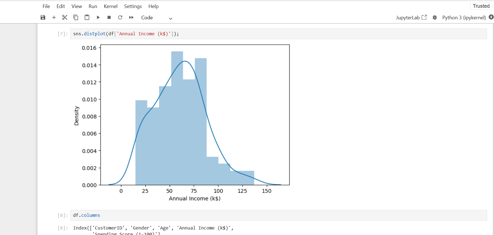
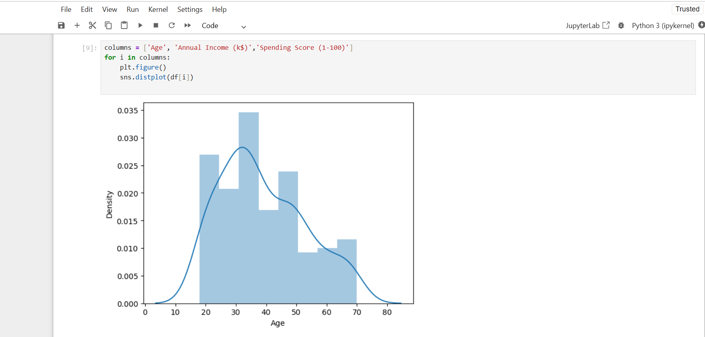
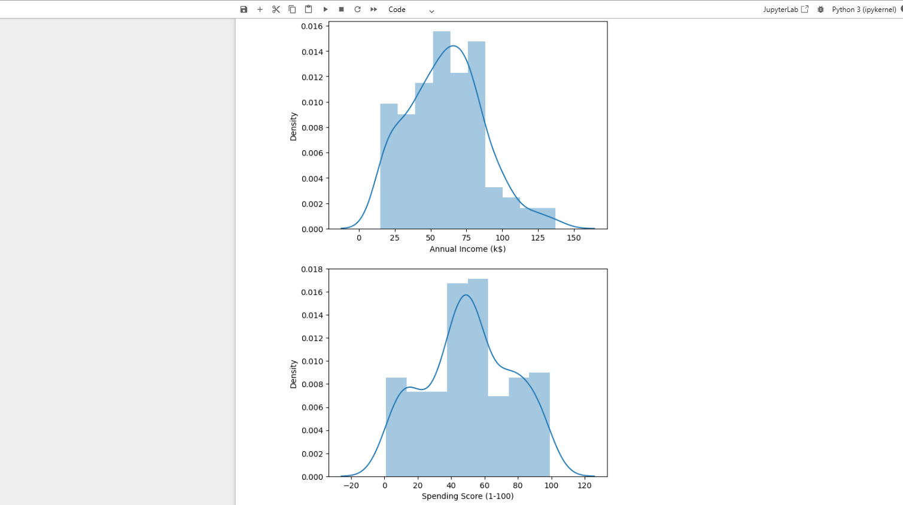
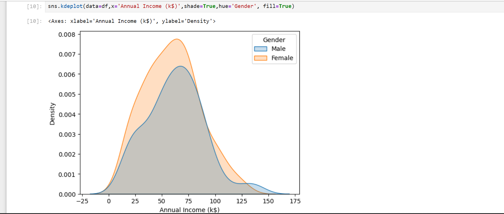
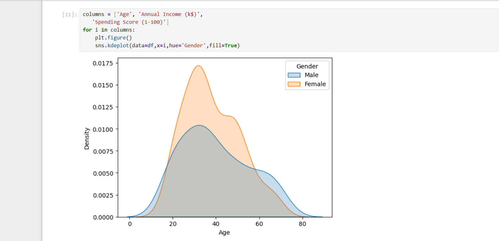
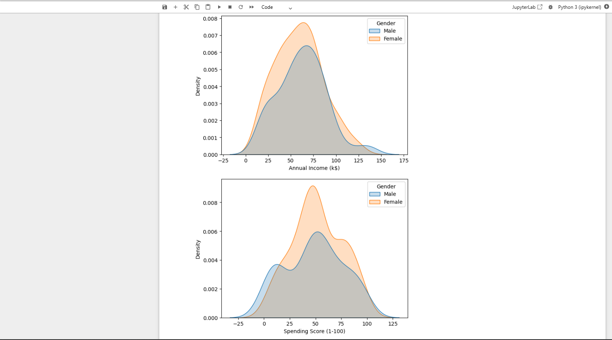
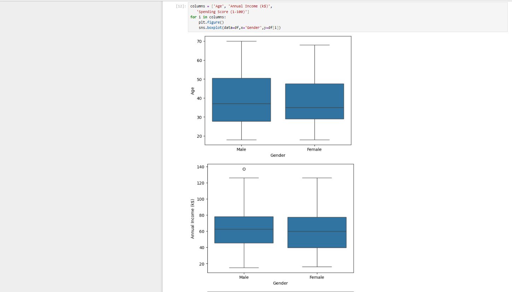
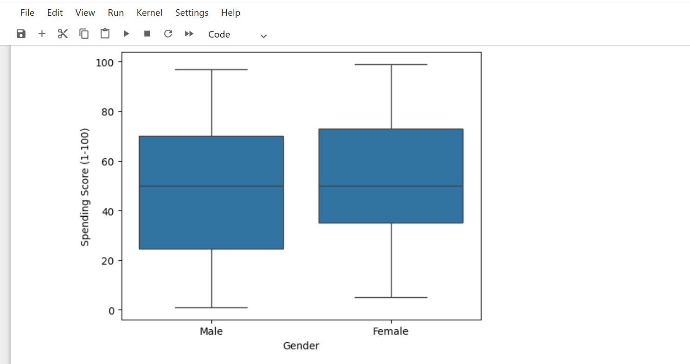

# customer_segmentation_and_analysis_using_python
A data-driven customer segmentation project using K-Means clustering to uncover valuable customer groups and improve business decision-making.
## 📌 Table of Contents

- 🔎 [Project Overview](#project-overview)
- 🎯 [Business Problem](#business-problem)
- 📂 [Dataset](#dataset)
- 🛠️ [Tools & Technologies](#tools--technologies)
- 📁 [Folder Structure](#folder-structure)
- 🧹 [Data Cleaning & Preparation](#data-cleaning--preparation)
- 📚 [Libraries Used](#libraries-used)
- 📊 [Exploratory Data Analysis (EDA) & Clustering](#exploratory-data-analysis-eda--clustering)
- 💡 [Key Insights & Recommendations](#key-insights--recommendations)
- 🔗 [References](#references)
- 👨‍💻 [Author & Contact](#author--contact)
---
## 🔎 Project Overview

This project performs customer segmentation using K-Means clustering to group customers based on spending behavior and income levels. The analysis includes data cleaning, exploratory data analysis (EDA), and cluster visualization to generate actionable business insights.
The project covers the complete data analysis workflow — including data cleaning, exploratory data analysis (EDA), feature selection, optimal cluster identification using the Elbow Method, and visualization of customer groups. By applying unsupervised machine learning techniques, the analysis reveals meaningful patterns within the dataset and provides actionable business insights.

---

## 🎯 Business Problem

The company lacks a structured way to segment customers based on purchasing behavior. The objective is to use K-Means clustering to identify distinct customer groups that can help improve targeted marketing and increase business revenue.
Businesses often treat all customers the same, using uniform marketing strategies without understanding differences in customer behavior. However, customers vary significantly in terms of purchasing patterns, income levels, and spending habits.

---

<h2 id="dataset">📂 Dataset</h2>

The dataset contains information about mall customers, including the following columns:

- CustomerID – Unique identifier for each customer

- Gender – Male or Female

- Age – Customer’s age in years

- Annual Income (k$) – Yearly income in thousands of dollars

- Spending Score (1–100) – A score representing customer spending behaviour

This dataset serves as the basis for exploratory analysis and K-Means clustering to identify customer segments.

---

<h2 id="tools-and-technologies">🛠️ Tools & Technologies</h2>

- Python – Programming language for data analysis

- Jupyter Notebook – Development environment for interactive coding

- Pandas – Data manipulation and preprocessing

- Matplotlib & Seaborn – Data visualization

- Scikit-learn – K-Means clustering, StandardScaler, One-Hot Encoding

These tools enabled end-to-end analysis, from data exploration to cluster modeling and visualization.

---
## 📁 Folder Structure

```
Customer-Segmentation-Project/
│
├── data/
│   └── Mall_Customers.csv
│
├── notebooks/
│   └── customer_segmentation.ipynb
│
├── images/
│   ├── elbow_method.png
│   ├── cluster_visualization.png
│   └── pairplot.png
│
├── README.md
└── requirements.txt
```

---

<h2 id="data-cleaning-preparation">🧹 Data Cleaning & Preparation</h2>

- Missing Values: Checked for nulls and ensured the dataset was complete with no missing entries.

- Data Types: Verified and corrected data types for accurate analysis (numerical vs categorical).

- Duplicate Records: Identified and removed duplicates.

- Feature Selection: Selected Age, Income, Spending Score, Gender for clustering.

- Preprocessing: Applied StandardScaler and One-Hot Encoding for advanced multivariate clustering.

These steps ensured the dataset was clean, consistent, and ready for EDA and K-Means clustering.

---

<h2 id="libraries-used">📚 Libraries Used</h2>

1. Pandas :	Data loading, manipulation, preprocessing

2. Matplotlib :	Plotting distributions, scatter plots, clusters

3. Seaborn :	Statistical visualizations (histograms, KDE, pairplots, heatmaps)

4. Scikit-learn :	K-Means clustering, StandardScaler, One-Hot Encoding

These libraries provided all tools required for analysis, visualization, preprocessing, and clustering.

---

<h2 id="eda-clustering">📊 Exploratory Data Analysis (EDA) & Clustering</h2>

It involves understanding the dataset, visualizing patterns, and applying K-Means clustering to segment customers for actionable insights.

# Univariate Analysis :
- Descriptive statistics (mean, median, quartiles)

- Histograms + KDE plots for Age, Income, Spending Score

- Observed:

     - Spending Score mostly between 40–60

     - Age & income normally distributed

- Gender-based comparison via boxplots:

     - Females → higher mean spending

     - Males → slightly higher income

















---

# Bivariate Analysis :

- Scatter plots for relationships between variables

- Annual Income vs Spending Score suggested natural clustering

- Pairplots for multivariate visualization

- Heatmap correlations:

     Age ↘ Spending Score

     Age ↘ Income

     Income ↗ Spending = weak

- Gender grouping for comparative metrics


